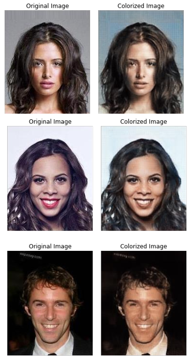
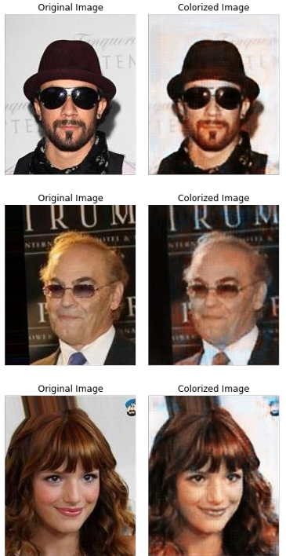
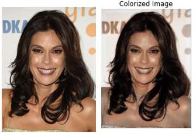

# Autoenkoder kolorujący obrazy twarzy celebrytów

Ten projekt zawiera autoenkoder, który został wytrenowany na zdjęciach twarzy celebrytów w skali szarości, a następnie używany jest do pokolorowania innych zdjęć twarzy.

## Wyniki

Poniżej znajdują się wyniki pokolorowania trzech różnych typów obrazów:
1. Pokolorowane obrazy ze zbioru uczącego.
   

2. Pokolorowane obrazy spoza zbioru uczącego.
   

3. Pokolorowany obraz o innym rozmiarze niż obrazy ze zbioru uczącego.
   

## Jak używać

Aby uruchomić autoenkoder i pokolorować obrazy twarzy, wykonaj następujące kroki:

1. Sklonuj repozytorium na swój komputer.
2. Zainstaluj wymagane biblioteki i zależności.
3. Uruchom wszystkie komórki w notatniku Autoencoder.ipynb

## Wymagania

Aby uruchomić ten projekt, wymagane są następujące biblioteki:

- numpy
- matplotlib
- Pytorch
- PIL

## Dane treningowe
https://www.kaggle.com/datasets/jessicali9530/celeba-dataset
